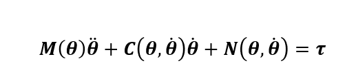

# Drone-simulation-code
これは指数座標の計算アルゴリズムでドローンの運動をシミュレーションのためにMATLABを用いて，プログラミングを作成する.

研究時間:1年予定

研究の予定:

ステップ1：指数座標の計算アルゴリズムを用いて，MATLABのプログラム(Test2)で以下の式の係数行列(M,C,N)を導出(作成中)

#クワットローターの運動方程式

ここで，
**M**は慣性行列
**C**はコリオリ行列
**N**は保存力の行列

ステップ2：Test2から計算の結果を用いて，シミュレーションのためMATLABで別のプログラムを作成(予定)

ステップ3：上記の運動方程式のシミュレーションは成功できれば，次に，PIDや現代制御理論など選び，クワットローターのモデルに導入し，MATLABのSimulink機能を用いて，新たなシミュレーションを作成(予定)
