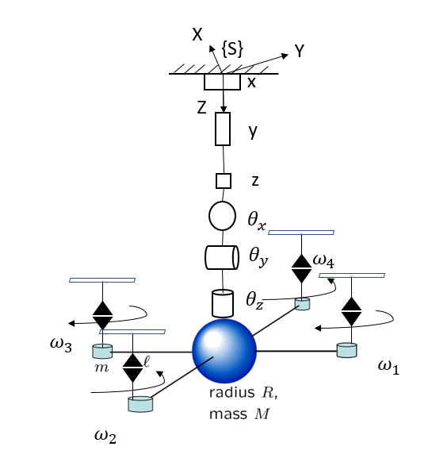

# Drone-simulation-code
これは指数座標の計算アルゴリズムでドローンの運動をシミュレーションのためにMATLABを用いて，プログラミングを作成する.

**1. 研究背景**
　新しい機械(アイデア)をデザインするとき，図面を作成した後，その機械は作成者の想像と同じように本当に運動するかどうか，次に，解析段階は非常に大切である．しかし，現代の機械の構造は非常に複雑となり，図面で機械の構成する部品(リンクや関節など)が多くなるので，解析のとき，計算も長く，複雑化された．このように，解析した後，機械のシミュレーションを作成するとき，解析のすべての数式を用いて，プログラムに導入する必要があるため，コーディングするのは大変である．また，もし，設計する途中で，機械の構造は少し調整したり，部品を追加したりしたければ，解析の段階が再び最初からやり直すひつようがある．そこで，指数座標という計算アルゴリズムを用いて，機械設計の解析に導入する方は様々なメリットがある．指数座標系では簡単に言うと，機械の各関節に典型的なOxyzのような座標系の代わりに一つの軸を用いて，それぞれの関節のパラメータを表現する．そのあと，それらのパラメータを用いて，解析や計算など行う．結果として，上記の数式を行列にまとめることができ，シミュレーションのプログラムなどコーディングの負担は軽減するのが可能である．特に，この計算アルゴリズムはMATLABを使用する人に非常に優れる．また，先行研究によると，この計算アルゴリズムは一般化されたとのことである．つまり，この計算アルゴリズムは様々機械タイプ(ロボットアームや車など)に適用できるといわれる．

**2. 研究目的**
　今まで，指数座標の計算アルゴリズムはほぼロボットアームやマニピュレータに適用し，解析することが多いとみられる．しかし，先行研究(1)によると，指数座標の計算アルゴリズムが様々種類の機械に適用し，解析するのが可能とのことである．すなわち，その方法は機械の自由度が仮想マニピュレータで表され，マニピュレータの指数座標の計算アルゴリズムを適用する．その図は以下に示される(図1)．それから，うちの研究室ではこの計算アルゴリズムが車設計の解析に適用するのが成功するが，飛行機タイプの機構の解析がまだ触れない．そこで，著者は飛行機タイプの機構の解析を研究にした．具体的に，著者はクワットローターのモデルを選んだ．

**3, 研究期間**
  
  1年間予定

**4 研究の進み**

**Step 0:**
クワットローターのモデルを描いて，解析し，指数座標の計算アルゴリズムで運動方程式を導出する
# クワットローターのモデル

**Step 1:**

指数座標の計算アルゴリズムを用いて，MATLABのプログラム(Test2)で以下の式の係数行列(M,C,N)を導出(作成中)

#クワットローターの運動方程式

ここで，

**M**は慣性行列

**C**はコリオリ行列

**N**は保存力の行列

**右辺**　は入力力やトルク

**Step2 :**

Test2から計算の結果を用いて，シミュレーションのためMATLABで別のプログラムを作成(予定)

**Step3 :**

上記の運動方程式のシミュレーションは成功できれば，次に，PIDや現代制御理論など選び，クワットローターのモデルに導入し，MATLABのSimulink機能を用いて，新たなシミュレーションを作成(予定)
